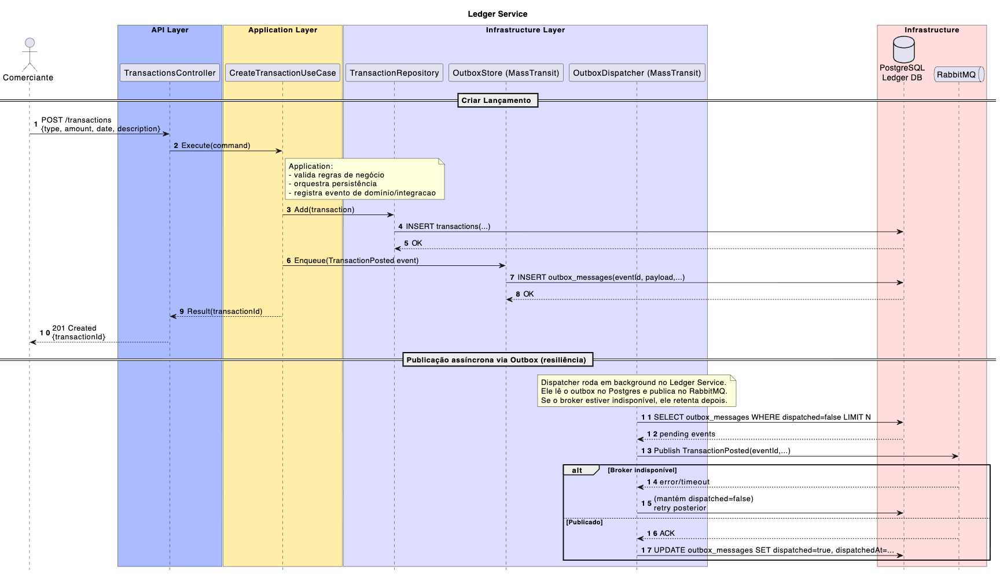
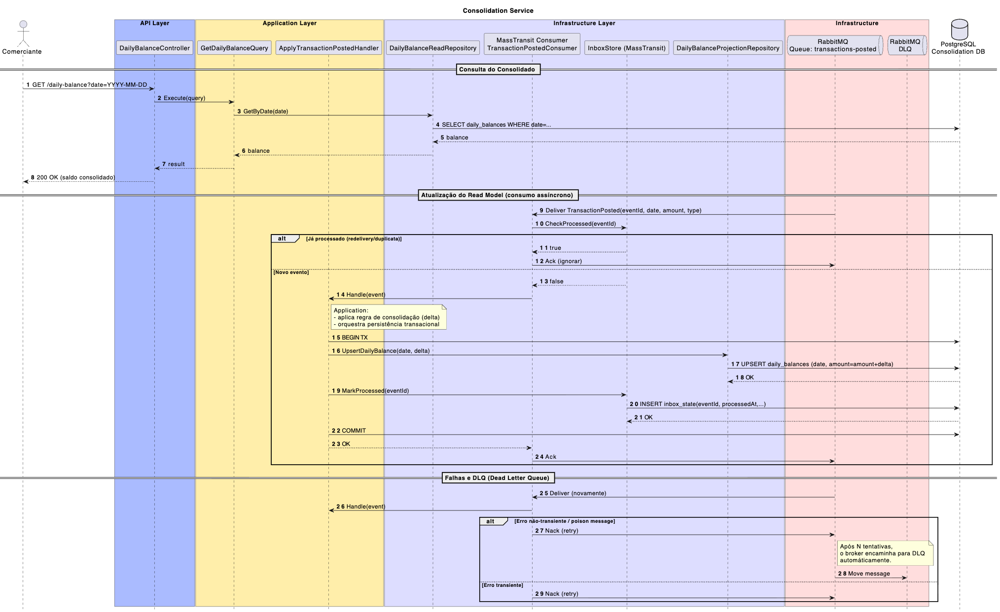
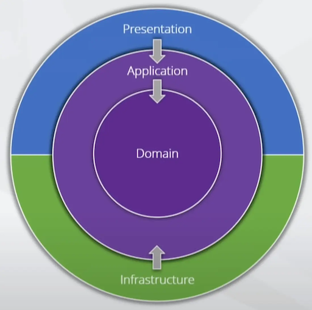
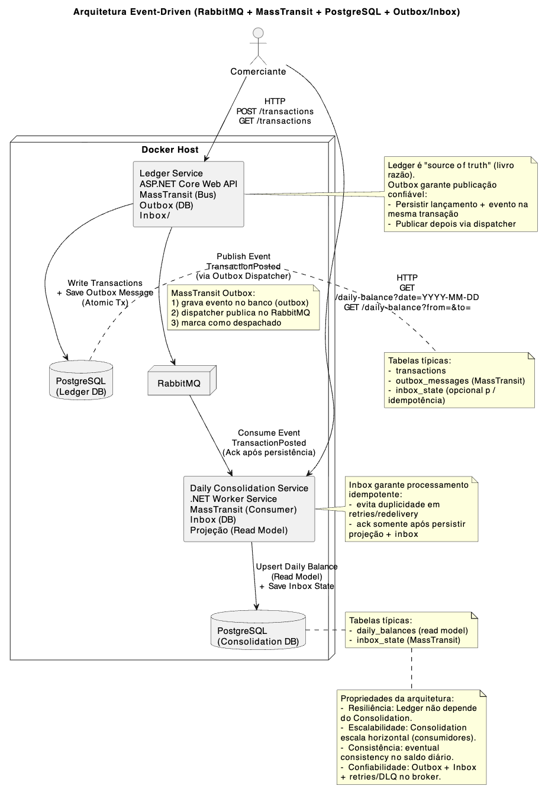

# Ledger & Consolidation – Arquitetura Event-Driven (.NET 9)

## 1. Visão Geral do Projeto

Este projeto foi desenvolvido como resposta ao [desafio de arquitetura de software da OPAH](docs/desafio-arquiteto-software-out2024.pdf), com o objetivo de propor e implementar uma arquitetura escalável, resiliente e bem documentada para demonstrar a capacidade de tomada de decisão arquitetural, análise de trade-offs e aplicação de boas práticas.

O domínio do problema consiste em permitir que um **comerciante** registre *lançamentos* financeiros (débitos e créditos) e consulte um saldo diário *consolidado*, garantindo que o serviço de lançamentos não fique indisponível caso o serviço de consolidação falhe.

O foco do projeto não é apenas o código, mas principalmente as decisões arquiteturais, a separação de responsabilidades, a resiliência do sistema e a clareza da documentação.

## 2. Escopo Funcional

### 2.1 Ledger (Lançamentos)

O serviço de Ledger é responsável por gerenciar os lançamentos financeiros, a seguir suas principais responsabilidades:

- API REST para criação e consulta de lançamentos
- Persistência dos dados transacionais (source of truth)
- Publicação de eventos de integração após commit

#### 2.1.1 Diagrama de Sequência - Criação de Lançamento




### 2.2 Consolidation (Consolidado Diário)

O serviço de Consolidation é responsável por manter o saldo diário consolidado, a seguir suas principais responsabilidades:

- Consumo assíncrono de eventos
- Manutenção de um read model consolidado por data
- API REST somente para leitura

#### 2.2.1 Diagrama de Sequência - Atualização do Consolidado Diário


## 3. Decisões Arquiteturais

Para atender aos requisitos do desafio, foi escolhidos o uso de clean architecture, separação de serviços e arquitetura event-driven.

### 3.1 Clean Architecture
O projeto segue os princípios da Clean Architecture, com camadas bem definidas e separação de responsabilidades
[Leia mais sobre Clean Architecture](https://learn.microsoft.com/pt-br/dotnet/architecture/modern-web-apps-azure/common-web-application-architectures#clean-architecture).



### 3.2 Separação de Serviços

O sistema é dividido em dois serviços distintos: Ledger e Consolidation.

**Prós**
- Isolamento de domínio
- Escalabilidade independente
- Manutenção facilitada

**Contras**
- Complexidade operacional maior
- Comunicação entre serviços


### 3.2 Arquitetura Event-Driven

A comunicação entre Ledger (Lançamentos) e Consolidation (Consolidado Diário) é assíncrona, baseada em eventos (event-driven architecture).

**Prós**
- Desacoplamento temporal
- Alta resiliência
- Escalabilidade independente

**Contras**
- Consistência eventual
- Complexidade operacional maior

### 3.2 Tecnologias Escolhidas

- **.NET 9**
    - Plataforma madura e performática
    - Com suporte a manutenção até 2029

- **RabbitMQ + MassTransit**
    - Broker de mensagens robusto e amplamente utilizado
    - MassTransit facilita a integração com .NET

- **PostgreSQL**
    - Banco relacional confiável e completo suporte a transações
    - Suporte nativo a JSONB para flexibilidade

- **Outbox/Inbox** (MassTransit transactional outbox/inbox)
    - Garante entrega confiável de eventos
    - Evita perda de mensagens em falhas

#### 3.2.1 RabbitMQ + MassTransit
Utilizados como broker de mensagens e abstraction layer.

:) **Prós**
- Integração madura com .NET
- Suporte nativo a Outbox/Inbox
- Fácil execução em Docker

 :( **Contras**
- Não é streaming (como Kafka)
- Overhead operacional adicional
    - Monitoramento do broker
    - Configuração de filas, exchanges e bindings
    - Manutenção do RabbitMQ

#### 3.2.2 Outbox / Inbox
Garantem confiabilidade e idempotência na troca de eventos.

:) **Prós**
- Eventos nunca se perdem
- Ledger permanece disponível mesmo se Consolidation estiver offline

 :( **Contras**
- Mais tabelas e migrations
- Código e infraestrutura adicionais

#### 3.2.3 PostgreSQL por Serviço
Cada serviço possui seu próprio banco.

:) **Prós**
- Isolamento total de domínio
- Evolução independente

 :( **Contras**
- Mais esforço operacional

### 3.3 Visão Geral da Arquitetura



## 4. Estrutura do Projeto

O projeto está organizado como slices por domínio e tipo de teste.

```bash
docs/ # Documentação do Projeto
src/ # Código Fonte
  Ledger/ # Serviço de Lançamentos
    API/ # Camada de Apresentação
    Application/ # Camada de Aplicação
    Domain/ # Camada de Domínio
    Infrastructure/ # Camada de Infraestrutura
  Consolidation/ # Serviço de Consolidado Diário
    API/ # Camada de Apresentação
    Application/ # Camada de Aplicação
    Domain/ # Camada de Domínio
    Infrastructure/ # Camada de Infraestrutura
  Shared/ # Codigo compartilhado entre Ledger e Consolidation

tests/ # Testes Automatizados
  UnitTests # Testes Unitários
  IntegrationTests # Testes de Integração
  ContractTests # Testes de Contrato

stress/ # Testes de Stress
  k6/ # Scripts k6 para testes de carga
```

## 5. Configuração no VS Code

A seguir estão as instruções para configurar o ambiente de desenvolvimento no VS Code.

### Pré-requisitos
- .NET SDK 9+
- Docker + Docker Compose
- VS Code

Extensões recomendadas:
- C# Dev Kit
- Docker

Abra o projeto com:
```
code .
```

Abra o terminal integrado:
```
Ctrl + `
```

Verifique se o .NET SDK está instalado:

``bash
dotnet --version
``

Caso não esteja, instale-o conforme o sistema operacional.

Windows: https://learn.microsoft.com/pt-br/dotnet/core/install/windows
Linux: https://learn.microsoft.com/pt-br/dotnet/core/install/linux
MacOS: https://learn.microsoft.com/pt-br/dotnet/core/install/macos

Após a instalação, reinicie o terminal e verifique novamente a versão do .NET SDK.

## 6. Compilação do Projeto

```bash
dotnet restore LedgerConsolidation.sln
dotnet build LedgerConsolidation.sln --no-restore
```

## 7. Executando com Docker

Na raiz do projeto:

```bash
docker-compose up -d --build
```

Serviços:
- Ledger API: http://localhost:5101
- Consolidation API: http://localhost:5201
- RabbitMQ UI: http://localhost:15672

### 7.1 Parar os Serviços

Para parar e remover os containers, redes e volumes criados:

```bash
docker-compose down -v
```

Caso queira apenas parar os containers sem removê-los:

```bash
docker-compose stop
```

Caso queira parar, remover o conteiner e os volumes associados:

```bash
docker-compose down -v --rmi all --remove-orphans  
```

### 7.2 Logs dos Serviços

```bash
docker-compose logs -f ledger_api
docker-compose logs -f consolidation_api
```

### 7.3 Logs dos Bancos de Dados

```bash
docker-compose logs -f pg_ledger
docker-compose logs -f pg_consolidation
```

### 7.4 Acessar o Banco de Dados

```bash
docker exec -it ledger-db psql -U ledger_user -d ledger_db
docker exec -it consolidation-db psql -U consolidation_user -d consolidation_db
```

### 7.5 RabbitMQ Management UI
Acesse em: http://localhost:15672
- **Usuário**: *VERIFIQUE NO ARQUIVO docker-compose.yml*
- **Senha**: *VERIFIQUE NO ARQUIVO docker-compose.yml*

## 8. Swagger / OpenAPI

Para acessar a documentação interativa das APIs, utilize os links abaixo
após iniciar os serviços com o Docker Compose.

- Ledger API: http://localhost:5101/swagger/index.html
- Consolidation API: http://localhost:5201/swagger/index.html

## 9. Autenticação JWT

As APIs estão protegidas com JWT Bearer Token.

### 9.1 Obter Token JWT
Para obter um token JWT válido, faça uma requisição POST para o endpoint de autenticação:

##### Ledger 

```bash
curl -X POST http://localhost:5101/auth/token \
  -H "Content-Type: application/json" \
  -d '{
    "username": "admin",
    "password": "admin"
  }'
```

##### Consolidation 

```bash
curl -X POST http://localhost:5201/auth/token \
  -H "Content-Type: application/json" \
  -d '{
    "username": "admin",
    "password": "admin" 
  }'
```

##### Resposta esperada

```
HTTP 200 OK
```

```json
{
  "token": "eyJhbGciOiJIUzI1NiIsInR5cCI6IkpXVCJ9..."
}
```

> Utilize o token retornado nas requisições subsequentes, incluindo-o no cabeçalho `Authorization`:

```bash
-H "Authorization: Bearer {token_jwt}"
```

## 10. Testes Manuais com Curl

### 10.1 Criar lançamento

```bash
curl -X POST http://localhost:5101/transactions \
  -H "Content-Type: application/json" \
  -H "Authorization: Bearer {token_jwt}" \
  -d '{
    "businessDate": "2026-01-11",
    "amount": 100,
    "type": "Credit",
    "description": "Venda"
  }'
```

##### Resposta esperada

```
HTTP 201 Created
```

```json
{
  "transactionId": "b1a2c3d4-e5f6-7890-ab12-cd34ef56gh78",
}
```

### 10.2 Consultar lançamento registrado

```bash
curl "http://localhost:5101/transactions/{transactionId}" \
  -H "Authorization: Bearer {token_jwt}"
```

##### Resposta esperada

```
HTTP 200 OK
```

```json
{
  "transactionId": "b1a2c3d4-e5f6-7890-ab12-cd34ef56gh78",
  "businessDate": "2026-01-11",
  "amount": 100,
  "type": "Credit",
  "description": "Venda",
}
```

### 10.3 Listar lançamentos

```bash
curl "http://localhost:5101/transactions?date=2026-01-11&pageNumber=1&pageSize=10" \
  -H  "Authorization: Bearer {token_jwt}"
```

##### Resposta esperada

```
HTTP 200 OK
```

```json
[
  {
    "transactionId": "b1a2c3d4-e5f6-7890-ab12-cd34ef56gh78",
    "businessDate": "2026-01-11",
    "amount": 100,
    "type": "Credit",
    "description": "Venda",
  },
  {
    "transactionId": "c2d3e4f5-6789-0123-ab45-cd67ef89gh90",
    "businessDate": "2026-01-11",
    "amount": 50,
    "type": "Debit",
    "description": "Compra",
  }
]
```

### 10.4 Consultar consolidado

```bash
curl "http://localhost:5201/daily-balance?date=2026-01-11" \
  -H  "Authorization: Bearer {token_jwt}"
```

##### Resposta esperada

```
HTTP 200 OK
```

```json
{
  "businessDate": "2026-01-11",
  "amount": 100,
}
```

### 10.5 Testes de Resiliência

#### 10.5.1 Derrubar o serviço de Consolidation e criar lançamentos

```bash
docker-compose stop consolidation_api
```

> Crie alguns lançamentos conforme o passo 8.1.
> *Resultado esperado*: Os lançamentos devem ser criados com sucesso, mesmo com o serviço de Consolidation offline.

#### 10.5.2 Subir o serviço de Consolidation e consultar o consolidado

```bash
docker-compose start consolidation_api
```

> Aguarde alguns segundos para o serviço processar os eventos pendentes e consulte o consolidado conforme o passo 8.4.
> *Resultado esperado*: O consolidado deve refletir os lançamentos criados enquanto o serviço estava offline.

#### 10.5.3 Derrubar o serviço de RabbitMQ e criar lançamentos

```bash
docker-compose stop rabbitmq
```

> Crie alguns lançamentos conforme o passo 8.1.
> *Resultado esperado*: Os lançamentos devem ser criados com sucesso, mas os eventos não serão entregues ao serviço de Consolidation.

#### 10.5.4 Subir o serviço de RabbitMQ e consultar o consolidado

```bash
docker-compose start rabbitmq
```
> Aguarde alguns segundos para o serviço processar os eventos pendentes e consulte o consolidado conforme o passo 8.4.
> *Resultado esperado*: O consolidado deve refletir os lançamentos criados enquanto o Rabbit

## 11. Testes Automatizados

```bash
dotnet test LedgerConsolidation.sln
```

## 12. Testes de Stress (k6)

### Leitura (50 rps)

```bash
docker run --rm -i --network host grafana/k6 run - < stress/k6/consolidation-get-daily-balance.js
```

### Escrita

```bash
docker run --rm -i --network host grafana/k6 run - < stress/k6/ledger-create-transaction.js
```

## 13. Migrations

As migrations são gerenciadas com o EF Core Migrations.

Para isso, garanta que o .NET SDK está instalado e siga os passos abaixo.

### 13.1 Consolidation

```bash
dotnet ef migrations add [MigrationName] \
  -p src/Consolidation/Consolidation.Infrastructure/Consolidation.Infrastructure.csproj \
  -s src/Consolidation/Consolidation.Api/Consolidation.Api.csproj \
  -c Consolidation.Infrastructure.Persistence.ConsolidationDbContext \
  -o Persistence/Migrations
```

### 13.2 Ledger

```bash
dotnet ef migrations add [MigrationName] \
  -p src/Ledger/Ledger.Infrastructure/Ledger.Infrastructure.csproj \
  -s src/Ledger/Ledger.Api/Ledger.Api.csproj \
  -c Ledger.Infrastructure.Persistence.LedgerDbContext \
  -o Persistence/Migrations
```

## 14. TO-DO List
- Observabilidade (metrics e tracing)
- Monitoramento do RabbitMQ
- Health Checks
- Cache no read model
- Pipeline CI/CD
- Configurar variaveis de ambiente sensíveis (ex: JWT secret, DB passwords)
- Testes de Integração

---

Desenvolvido por @chcmatos
- [GitHub](@chcmatos)
- [LinkedIn](https://www.linkedin.com/in/chcmatos)
